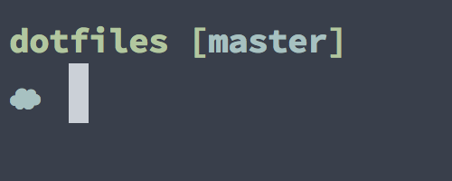

# Armno's dotfiles

## setting up

```sh
$ cd ~/code
$ git clone git@github.com:armno/dotfiles.git
```

### vim

my vim setup requires [ag](https://github.com/ggreer/the_silver_searcher)
and [editorconfig](http://editorconfig.org), which can be installed by

```sh
$ brew install the_silver_searcher editorconfig
```

then set up vim and vundle.

```sh
$ ln -s ~/code/dotfiles/.vim ~/.vim
$ git clone https://github.com/gmarik/Vundle.vim.git ~/.vim/bundle/Vundle.vim
$ ln -s ~/code/dotfiles/.vimrc ~/.vimrc
$ vim +PluginInstall +qall
```

adding new plugin / updating existing plugins, see [Vundle](https://github.com/gmarik/Vundle.vim)

### git

fyi: non fast-forward merge strategy is my default git config.

```sh
$ ln -s ~/code/dotfiles/.gitconfig ~/.gitconfig
```

### osx

```sh
$ ln -s ~/code/dotfiles/.osx ~/.osx
```

### aliases, functions

```sh
$ ln -s ~/code/dotfiles/.aliases ~/.aliases
$ ln -s ~/code/dotfiles/.functions ~/.functions
```

### ag

`ag`'s ignored patterns. normally `ag` ignores patterns in `.gitignore` file but still, there are some files in the repo that shouldn't show up in `CtrlP`.

```sh
$ ln -s ~/code/dotfiles/.agignore ~/.agignore
```

### prezto

use my customized cloud theme for prezto.

```sh
$ ln -s ~/code/dotfiles/prompt_armno_setup ~/.zprezto/modules/prompt/functions/prompt_armno_setup
```

then change `theme` option in `~/.zpreztorc` file to `armno`


